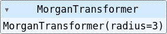

# Scikit-Mol
## scikit-learn compatible RDKit transformers

Scikit-mol is a collection of scikit-learn compatible transformer classes that integrate into the scikit-learn framework and thus bridge between the molecular information in form of RDKit molecules or SMILES and the machine learning framework from scikit-learn


The transformer classes are easy to load, configure and use to process molecular information into vectorized formats using fingerprinters or collections of descriptors. For demonstration purposes, let's load a MorganTransformer, that can convert a list of RDKit molecular objects into a numpy array of morgan fingerprints. First create some molecules from SMILES strings.


```python
from IPython.core.display import HTML
```


```python
from rdkit import Chem

smiles_strings = ["C12C([C@@H](OC(C=3C=CC(=CC3)F)C=4C=CC(=CC4)F)CC(N1CCCCCC5=CC=CC=C5)CC2)C(=O)OC", 
"O(C1=NC=C2C(CN(CC2=C1)C)C3=CC=C(OC)C=C3)CCCN(CC)CC",
"O=S(=O)(N(CC=1C=CC2=CC=CC=C2C1)[C@@H]3CCNC3)C",
"C1(=C2C(CCCC2O)=NC=3C1=CC=CC3)NCC=4C=CC(=CC4)Cl",
"C1NC[C@@H](C1)[C@H](OC=2C=CC(=NC2C)OC)CC(C)C",
"FC(F)(F)C=1C(CN(C2CCNCC2)CC(CC)CC)=CC=CC1"]

mols = [Chem.MolFromSmiles(smiles) for smiles in smiles_strings]
```

Next we import the Morgan fingerprint transformer


```python
from scikit_mol.transformers import MorganTransformer

transformer = MorganTransformer(radius=3)
print(transformer)
```

    MorganTransformer(radius=3)


It actually renders as a cute little interactive block in the Jupyter notebook and lists the options that are not the default values. If we print it, it also gives the information on the settings. 



The graphical representation is probably nice when working with complex pipelines. However, the graphical representation doesn't work when previewing the notebook on GitHub or nbviewer.org, so for the rest of these scikit-mol notebook examples, we'll use the print() output.

If we want to get all the settings explicitly, we can use the .get_params() method.


```python
parameters = transformer.get_params()
parameters
```


    {'nBits': 2048,
     'radius': 3,
     'useBondTypes': True,
     'useChirality': False,
     'useCounts': False,
     'useFeatures': False}


The corresponding .set_params() method can be used to update the settings from options or from a dictionary (via ** unpackaging). The get_params and set_params methods are sometimes used by sklearn, as example hyperparameter search objects.


```python
parameters["radius"] = 2
parameters["nBits"] = 256
transformer.set_params(**parameters)
print(transformer)
```

    MorganTransformer(nBits=256)


Transformation is easy, simply use the .transform() method. For sklearn compatibility the scikit-learn transformers also have a .fit_transform() method, but it is usually not fitting anything.


```python
fps = transformer.transform(mols)
print(f"fps is a {type(fps)} with shape {fps.shape} and data type {fps.dtype}")
```

    fps is a <class 'numpy.ndarray'> with shape (6, 256) and data type float64


For sklearn compatibility, the transform function can be given a second parameter, usually representing the targets in the machine learning, but it is simply ignored most of the time


```python
y = range(len(mols))
transformer.transform(mols, y)
```


    array([[0., 1., 0., ..., 0., 0., 0.],
           [1., 0., 0., ..., 0., 0., 1.],
           [1., 0., 0., ..., 0., 0., 0.],
           [0., 0., 0., ..., 0., 0., 1.],
           [1., 1., 0., ..., 0., 0., 0.],
           [1., 1., 0., ..., 0., 0., 0.]])


Sometimes we may want to transform SMILES into molecules, and scikit-mol also has a transformer for that. It simply takes a list of SMILES and produces a list of RDKit molecules, this may come in handy when building pipelines for machine learning models, as we will demo in another notebook.


```python
from scikit_mol.transformers import SmilesToMol
smi2mol = SmilesToMol()
print(smi2mol)
```

    SmilesToMol()


```python
print(smi2mol.transform(smiles_strings))
```

    [<rdkit.Chem.rdchem.Mol object at 0x7f3670876fa0>, <rdkit.Chem.rdchem.Mol object at 0x7f363dc5be80>, <rdkit.Chem.rdchem.Mol object at 0x7f363dc5bb20>, <rdkit.Chem.rdchem.Mol object at 0x7f363dc5bee0>, <rdkit.Chem.rdchem.Mol object at 0x7f363dc5bf40>, <rdkit.Chem.rdchem.Mol object at 0x7f363dc5bfa0>]

